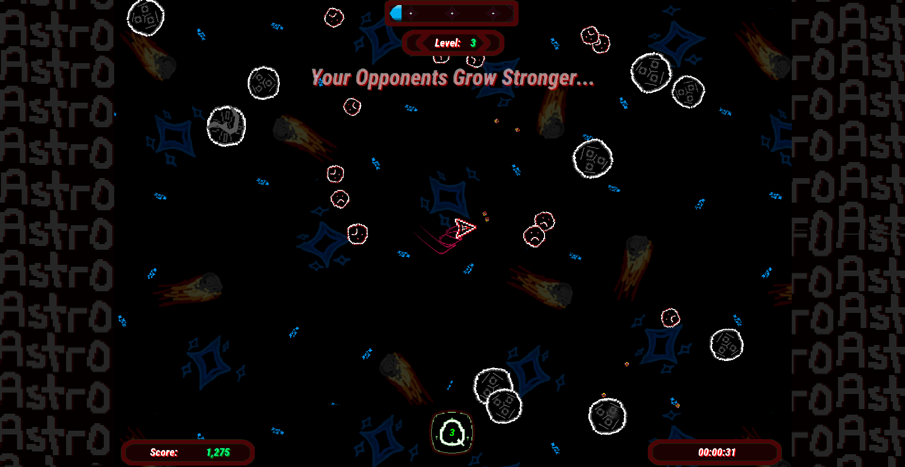

# Do you remember the Atari game Asteroids?
# Do you wish it had some more replayability?

## Introducting - **AstroLite!** 

## Permanent Upgrades have been created for endless enjoyment

## Gameplay is varied with random enemies added each attempt

## Level Up to make your character even stronger

## Development Roadmap for AstroLite:
1.  ~~Custom voiced SFX~~ 
2.  ~~Scalable gameplay, similar to Risk of Rain progression!~~
3.  ~~Upgrades! Like Vampire Survivors!~~
4.  ~~Custom artwork, hand drawn by somebody with no business hand drawing artwork!~~
5.  ~~8-bit music from various artists!~~
6.  ~~Different quality of upgrades in-game (common, rare, legendary)~~
7.  Challenge Modes to spice up gameplay and reward you with extra permanent shop currency!
8.  Over 20 different special enemies that cycle in randomly each run!
9.  Secrets placed in different environments!
10. Unique new playable characters that all have an exclusive quirk!

    
© Mathieu Barrette - June 20, 2024

Replication for purpose of profit and monetization strictly prohibited 
Licenced under DBAD 
This repository exists for the sole purpose of playtesting and feedback, gameplay
experiences here will not reflect the final product
